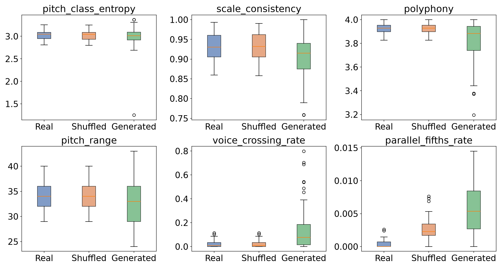

# bach-gen

Evaluating and generating Bach chorales with a small transformer.

## Metric Validity Study

Standard metrics for symbolic music generation — pitch-class entropy, scale consistency, polyphony, pitch range — are widely used to evaluate generative models. But do they actually measure musical quality?

To find out, a small decoder-only transformer (~1.85M parameters) is trained on the [JSB Chorales dataset](https://github.com/czhuang/JSB-Chorales-dataset) and three test sets are compared:

| Set | Description |
|---|---|
| **Real Bach** | 77 test chorales withheld from training |
| **Shuffled** | The same 77 chorales with bars randomly reordered — locally identical to Bach, structurally destroyed |
| **Generated** | 77 chorales sampled from the trained model |

### Key finding

Distributional metrics cannot distinguish shuffled Bach from real Bach (*p* ≈ 1 for all four). Counterpoint-based metrics introduced in this study — voice crossing, parallel fifths, cadence quality, boundary-interval analysis — separate the sets with effect sizes up to *r* = 0.85. Each metric family is blind to failures outside its own domain, making single-metric evaluation unreliable.



### Results

| Metric | Real Bach | Shuffled | Generated |
|---|---|---|---|
| Pitch class entropy | 3.026 | 3.021 | 2.985 |
| Scale consistency | 0.930 | 0.930 | 0.903 |
| Pitch range | 34.351 | 34.351 | 32.610 |
| Polyphony | 3.923 | 3.923 | 3.817 |
| Voice crossing rate | 0.021 | 0.021 | 0.142 |
| Parallel fifths rate | 0.0004 | 0.0026 | 0.0059 |
| Proper cadence | 97.4% | 80.5% | 22.1% |

### Statistical tests

Effect sizes reported as rank-biserial correlation |*r*|. Bold = significant after Holm–Bonferroni correction.

| Metric | Real vs. Shuffled | | Real vs. Generated | |
|---|---|---|---|---|
| | *p* | \|*r*\| | *p* | \|*r*\| |
| Pitch class entropy | 0.817 | 0.02 | 0.249 | 0.11 |
| Scale consistency | 0.868 | 0.02 | **0.002** | **0.29** |
| Polyphony | 1.000 | 0.00 | **< 0.001** | **0.40** |
| Pitch range | 1.000 | 0.00 | **0.004** | **0.27** |
| Voice crossing | 1.000 | 0.00 | **< 0.001** | **0.49** |
| Parallel fifths | **< 0.001** | **0.85** | **< 0.001** | **0.85** |
| Boundary interval | **< 0.001** | **0.84** | 0.355 | 0.09 |
| Cadence (Fisher's) | **0.001** | – | **< 0.001** | – |

Full results, interpretation, and discussion are in the [report](report.pdf).

This work was completed as Assignment 3 for the course Generative Artificial Intelligence (IM1412) at the Open Universiteit and received a grade of **9.0/10**.

## Setup

**Dataset:** Download `jsb-chorales-16th.pkl` from [czhuang/JSB-Chorales-dataset](https://github.com/czhuang/JSB-Chorales-dataset) and place it in the repo root.

**Dependencies:**
```
pip install torch numpy pandas matplotlib pretty_midi muspy music21 scipy
```

**Run order:** `1_training.ipynb` → `2_evaluation.ipynb`

Training takes ~15 minutes on a 4GB GPU. The evaluation notebook runs on CPU. `gen_chorales.json` and `Bach_model.pt` are included so the evaluation notebook can be run without training first.
